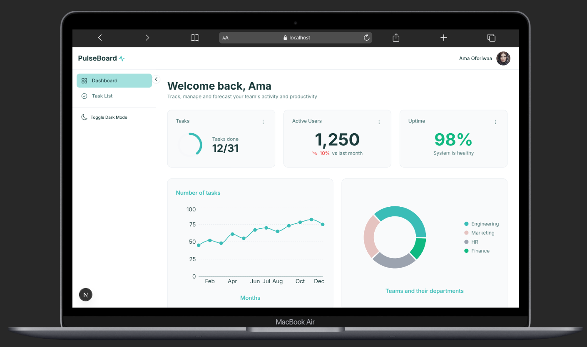

# PulseBoard

A modern, lightweight team productivity dashboard built with Next.js, TypeScript, and Tailwind CSS. Track tasks, monitor KPIs, and manage team activity with a clean, responsive interface.



## Features

### Dashboard Overview

- **Real-time KPI Tracking** - Monitor tasks completed, active users, and system uptime
- **Interactive Charts** - Visualize task completion trends and team distribution
- **Recent Activity Feed** - Stay updated with team task movements
- **Dark/Light Mode** - Seamless theme switching with persistent preferences

### Task Management

- **Smart Search & Filtering** - Find tasks instantly with real-time search
- **Dynamic Sorting** - Sort by title, status, date created, or deadline
- **Status Tracking** - Visual badges for Completed, In Progress, Blocked, and To Do
- **Team Assignments** - View and manage multiple assignees per task
- **Pagination** - Efficient data browsing with 8 tasks per page

### User Experience

- **Fully Responsive** - Optimized for desktop, tablet, and mobile devices
- **Smooth Animations** - Polished micro-interactions and transitions
- **Accessible** - WCAG AA compliant with keyboard navigation support
- **Loading States** - Skeleton loaders for better perceived performance

---

## Tech Stack

- **Framework:** [Next.js 15](https://nextjs.org/) with App Router
- **Language:** [TypeScript](https://www.typescriptlang.org/)
- **Styling:** [Tailwind CSS](https://tailwindcss.com/)
- **Charts:** [Recharts](https://recharts.org/)
- **Icons:** Custom SVG icons
- **Testing:** [Vitest](https://vitest.dev/) + [React Testing Library](https://testing-library.com/react)
- **Theme Management:** [next-themes](https://github.com/pacocoursey/next-themes)
- **Date Handling:** [date-fns](https://date-fns.org/)

---

## Quick Start

### Prerequisites

- Node.js 18+ and npm

### Installation

1. **Clone the repository**

```bash
   git clone https://github.com/yourusername/pulseboard.git
   cd pulseboard
```

2. **Install dependencies**

```bash
   npm install
```

3. **Run the development server**

```bash
   npm run dev
```

4. **Open your browser**

```
   Navigate to http://localhost:3000
```

That's it! The application is now running locally.

---

## Available Scripts

```bash
npm run dev          # Start development server
npm run build        # Build for production
npm run start        # Start production server
npm run lint         # Run ESLint
npm test             # Run test suite
npm run test:ui      # Run tests with UI
npm run test:coverage # Generate coverage report
```

---

## Project Structure

```
pulseboard/
├── app/
│   ├── (dashboard)/          # Dashboard route group
│   │   ├── layout.tsx        # Shared dashboard layout
│   │   ├── page.tsx          # Dashboard overview
│   │   ├── loading.tsx       # Loading state
│   │   └── tasks/
│   │       ├── page.tsx      # Task list page
│   │       └── loading.tsx   # Tasks loading state
│   ├── layout.tsx            # Root layout
│   ├── providers.tsx         # Theme provider
│   └── globals.css           # Global styles
│
├── components/
│   ├── ui/                   # Reusable UI components (atoms)
│   │   ├── button.tsx
│   │   ├── badge.tsx
│   │   ├── input.tsx
│   │   ├── modal.tsx
│   │   ├── avatar.tsx
│   │   ├── skeleton.tsx
│   │   └── __tests__/        # Component tests
│   │
│   ├── layout/               # Layout components
│   │   ├── sidebar.tsx
│   │   ├── header.tsx
│   │   └── mobile-menu.tsx
│   │
│   ├── dashboard/            # Dashboard-specific components
│   │   ├── kpi-card.tsx
│   │   ├── chart-card.tsx
│   │   ├── activity-item.tsx
│   │   └── __tests__/
│   │
│   └── tasks/                # Task-specific components
│       ├── task-table.tsx
│       ├── task-row.tsx
│       ├── task-modal.tsx
│       ├── status-badge.tsx
│       └── __tests__/
│
├── lib/
│   ├── utils.ts              # Utility functions
│   └── constants.ts          # Mock data & constants
│
├── types/
│   └── index.ts              # TypeScript type definitions
│
└── public/                   # Static assets
```

---

## Design System

### Colors

- **Primary:** `#1A3C3F` - Deep teal for branding
- **Secondary:** `#3ABDB7` - Bright teal for accents
- **Success:** `#10B981` - Green for completed states
- **Error:** `#EF4444` - Red for blocked states
- **Info:** `#3B82F6` - Blue for in-progress states

### Typography

- **Font:** Inter (400, 500, 600, 700)
- **Line Heights:** 100% for large text (>16px), 130% for small text (≤16px)

### Components

All components follow atomic design principles:

- **Atoms:** Button, Badge, Input, Avatar
- **Molecules:** KPI Card, Task Row, Status Badge
- **Organisms:** Sidebar, Task Table, Chart Card

---

## Testing

The project includes comprehensive unit tests for all UI components.

### Run Tests

```bash
# Run all tests
npm test

# Run tests in watch mode
npm test -- --watch

# Generate coverage report
npm run test:coverage
```

### Test Coverage

- ✅ 28 passing tests
- ✅ 7 test suites
- ✅ Components tested: Button, Badge, Input, Avatar, Modal, KPI Card, Status Badge

---

## Deployment

### Deploy to Vercel (Recommended)

1. **Push your code to GitHub**

2. **Import to Vercel**

   - Go to [vercel.com](https://vercel.com)
   - Click "New Project"
   - Import your GitHub repository
   - Vercel auto-detects Next.js settings
   - Click "Deploy"

3. **Done!** Your app is live in ~2 minutes

### Environment Variables

No environment variables required for the demo version.

---

## Architecture Decisions

### Why Next.js App Router?

- Server Components for optimal performance
- Built-in routing and layouts
- Excellent TypeScript support
- Production-ready out of the box

### Why Tailwind CSS?

- Rapid UI development
- Consistent design system
- Excellent dark mode support
- Small bundle size with purging

### Why Recharts?

- React-native API
- Highly customizable
- Good TypeScript support
- Lightweight (~50kb gzipped)

---

## Contributing

This is a portfolio/assignment project. However, feedback and suggestions are welcome!

---

## License

MIT License - feel free to use this project for learning purposes.

---

## Author

**Prince Kongo**

- LinkedIn: [Prince Kongo](https://www.linkedin.com/in/pkongo/)
- GitHub: [@kaykongo](https://github.com/kaykongo)

---

## Acknowledgments

- Design inspired by modern SaaS dashboards from Dribble and Mobbin
- Built as a technical assessment for Clanktech
- Special thanks to the Next.js and React communities

---

**Built with ❤️ using Next.js, TypeScript, and Tailwind CSS**
